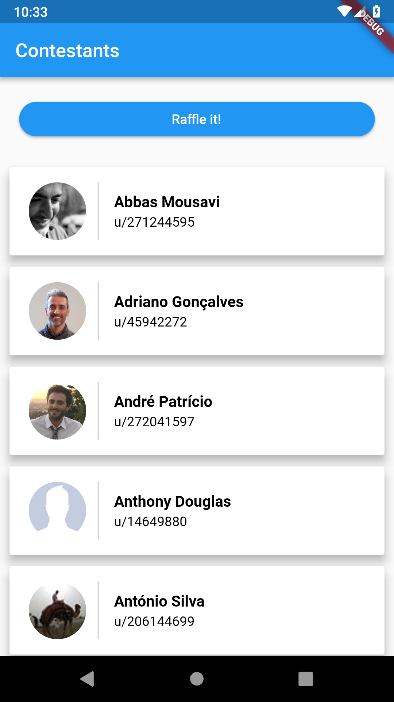

# Flutter a new hope for single code base Apps

## 2019 kickoff with mobile.lx

---

### Bruno Oliveira

### Mobile developer @Unbabel

---

## Flutter a new hope for single code base Apps

- Problem

^
why do we need single code base apps

---

## Flutter a new hope for single code base Apps

- Problem
- Other Frameworks

^
Overview of the current single code base platforms

---

## Flutter a new hope for single code base Apps

- Problem
- Other Frameworks
- Flutter analysis

^
Describe what is flutter
What flutter & dart can do for you

---

## Flutter a new hope for single code base Apps

- Problem
- Other Frameworks
- Flutter analysis
- Code examples

^
Some code snippets of flutter

---

## Flutter a new hope for single code base Apps

- Problem
- Other Frameworks
- Flutter analysis
- Code examples
- Useful information

^
Useful links and repositories

---

## Problem

- Android
- iOS / MacOS
- Windows

^
Why should I ever need to have a single code base app/s
Multiple platforms
Not all the cases are the same.
NEXT ANDROID FRAGMENTATION

---

## Problem

- Android
  - Android 4.0, 4.4, 5 ...
  - Custom Roms
- iOS / MacOS
- Windows

---

# Existing alternatives

---


---

## Pros

- Native components
- Javascript
- Development app reload time
- High percentage of reused code

^
In the end components will be native
Easy entry point for web and new developers
Almost 70/80% code reuse

---

## Cons

- Javascript
- The bridge
- Performance
- iOS/Android

^
Javascript single thread problems
iOS is the big favored, android has good support and Windows is kinda faulty

---


---

## Pros

- Compiled into bytecode
- Also supports some MacOS components
- Basic MVPs can have up to 100% codeshare with .Forms

^
Lib for macos components
.Forms for simple layouts

---

## Cons

- Performance on heavy UI apps
- Size of the community
- Larger app size
- Delayed support for new OS Platform updates

^
Intense UI tends not to be fluid
C#
15% of the mobile
Simple hello world can take up to 16MB
New components and apis tend to take some time to be available for usage

---


---

## Flutter how it works


^
High level Widgets for Android and iOS
Widgets gets rendered
All of this is rendered on the render engine

---


---

## Pros

- Syntax similar to Java
- Interpreted and compiled
- Hot reload
- Asynchronous programming

^
Promisses aka futures async and await

---

## Cons

- Not well established
- Syntax sugar features

^
Opensource libs and components
But it's growing a lot

---


---

## Pros

- Fully reactive mindset
- Easy learning curve
- Low boilerplate code
- Performance on low-end devices
- Multiple IDE support

^
Android studio, intelliJ, visual code

---

## Cons

- "official" architecture still not defined
- App size
- Some questions about iOS support for OS updates

^
Can be a good thing but for beginers can be tough
Redux, Bloc, ScopedModel, statefull widgets
iOS pixel perfect widgets for iOS10 were released on Release Preview 2, while the iOS11 already was out for a few months
Simple hello world can take up to 4.7MB, but it's dropping it was around

---

## Flutter in action - Screens


---

## Flutter in action - Screens



---

## Lucky One Screen

```dart

Scaffold(
      appBar: AppBar(
        title: Text('And the grand winner is'),
      ),
      body: Center(
        child: Column(
          mainAxisAlignment: MainAxisAlignment.center,
          children: <Widget>[
            _photoContainer(),
            _nameContainer()
          ],
        ),
      ),
    )

```

^
What Scafold is
Center / column

---

## Navigator

```dart

Navigator.push(
  context,
  MaterialPageRoute(builder: (context) => RaffleWinnerScreen(winner))
  );

```

^
Push/Pop/PushClear
Simple navigation handling (Back and app bar arrows/backs)

---

## Rich Text

```dart

Directionality(
      textDirection: TextDirection.rtl,
      child: RichText(
          textAlign: TextAlign.center,
          text: TextSpan(
              style: TextStyle(fontSize: 40, fontWeight: FontWeight.bold),
              text: _text)),
    );

```

^
Customization everywhere

---

## Photo Container

```dart
Container(
      child: Hero(
        tag: winner.photoURL,
        child: Container(
            decoration: BoxDecoration(
                boxShadow: [BoxShadow(spreadRadius: 2, blurRadius: 2, color: Colors.black26 )],
                shape: BoxShape.circle,
                image: DecorationImage(
                    fit: BoxFit.cover,
                    image: NetworkImage(winner.photoURL)
                )
            )),
      ),
    )
```

^
More complex view
Rounded and shadow

---

## Reusability of widgets

```dart
class BoldTitleText extends StatelessWidget {
  final String _text;

  BoldTitleText(this._text);

  @override
  Widget build(BuildContext context) {
    return Directionality(
      textDirection: TextDirection.rtl,
      child: RichText(
          textAlign: TextAlign.center,
          text: TextSpan(
              style: TextStyle(fontSize: 40, fontWeight: FontWeight.bold),
              text: _text)),
    );
  }
}
```

^
Custom reusable widgets

---

## HTTP Requests

```dart
  import 'package:http/http.dart' as http;

  static Future<http.Response> _fetchContestants() {
    return http.get(MeetupURL);
  }
```

^
Really simple to use

---

## Response parsing

```dart
  import 'dart:convert';

  static Future<List<Contestant>> fetchContestants() async {
    final response = await _fetchContestants();

    if (response.statusCode == 200) {
      final values = json.decode(response.body);
      return values.map((value) => Contestant.fromJson(value)).cast<Contestant>().toList();
    } else {
      throw Exception('Failed to load post');
    }
  }
```

^
Base dart package
Map -> toList() cast problems
return error states

---

## Detailed parsing

```dart
  factory Contestant.fromJson(Map<String, dynamic> json) {
    return Contestant(
        identifier: json["member"]["id"],
        name: json["member"]["name"],
        photoURL: json['member']["photo"]["photo_link"],
        isOrganizer: json['member']['event_context']['host'],
        hasConfirmed: (json['response'] as String).toLowerCase() == "yes");
  }
```

^
Key value parsing

---

## Conclusions

- Performance

---

## Conclusions

- Performance
- Fast development cycles

^
Hot reload
Simplicity of widgets

---

## Conclusions

- Performance
- Fast development cycles
- High percentage of reused code

^
All base models and business logic shared
Some Widgets automatically have Material and cupertino versions
Custom widgets with forks

---

## Conclusions

- Performance
- Fast development cycles
- High percentage of reused code
- Perfect for companies with custom experiences

^
If you have custom ui is perfect

---

## Useful links

- https://github.com/bmoliveira/mobile-lx.raffle
- https://flutter.io
- https://github.com/Solido/awesome-flutter
- https://github.com/2d-inc/HistoryOfEverything

---

# Questions?
